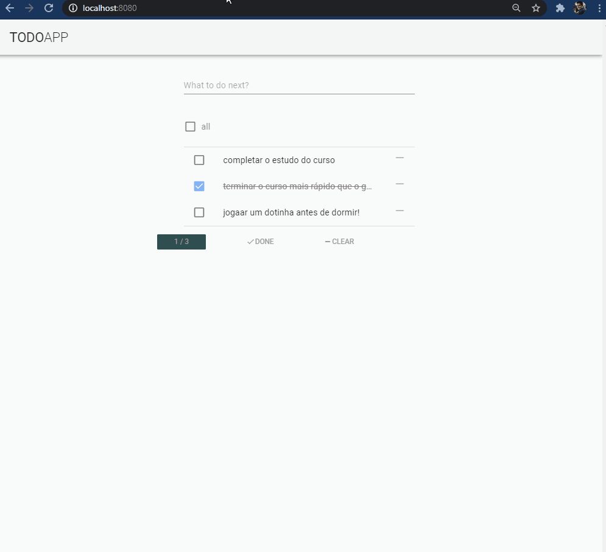

<h1 align="center">
    
</h1>

  <a href="#-technologies">Technologies</a>&nbsp;&nbsp;&nbsp;|&nbsp;&nbsp;&nbsp;
  <a href="#-project">Project</a>&nbsp;&nbsp;&nbsp;|&nbsp;&nbsp;&nbsp;
  <a href="#memo-licença">Licença</a>

 

  

## 🔖 Project

Todo app it is a [simple course presented by Andre Madarang](https://www.youtube.com/watch?v=A5S23KS_-bU) to learn all vue and vuetify features and good pratices

## 🚀 Technologies

- Vue
- Vuetify

## :memo: Licença

Project under MIT license. Visit [LICENSE](LICENSE.md) to more.
